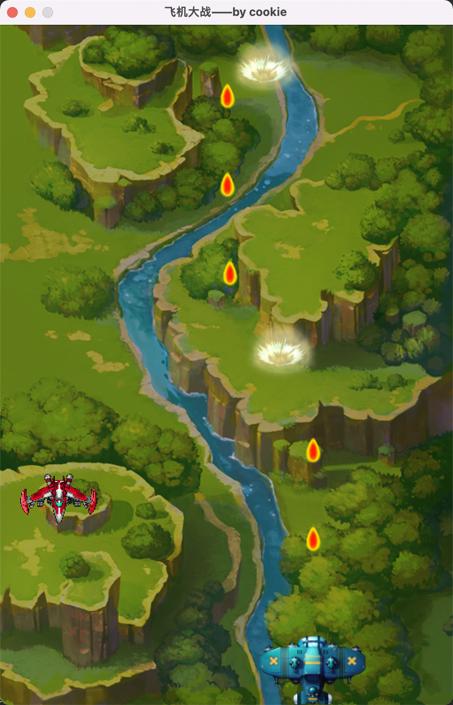

# 背景说明
这是一个基于QT5.9的飞机大战项目，[技巧总结](./skills.txt) 列出了开发过程中遇到的常见功能的实现方法\
参考资料：[B站：Qt案例_飞机大战](https://www.bilibili.com/video/BV1xy4y1m794?p=1)\
参考资料：[传智教育：官网图文案例_飞机大战](http://www.itcast.cn/news/20200116/16250978607.shtml)

# 项目架构
## main.cpp
> 项目入口文件，固定写法
~~~C++
#include "mainwindow.h"
#include <QApplication>

int main(int argc, char *argv[])
{
    QApplication a(argc, argv);
    MainWindow w;
    w.show();

    return a.exec();
}
~~~

# TODO
- 爆炸效果的管理（见：[技巧总结](./skills.txt) 讨论）
- 血条
- 经验值与升级
- 分数与关卡